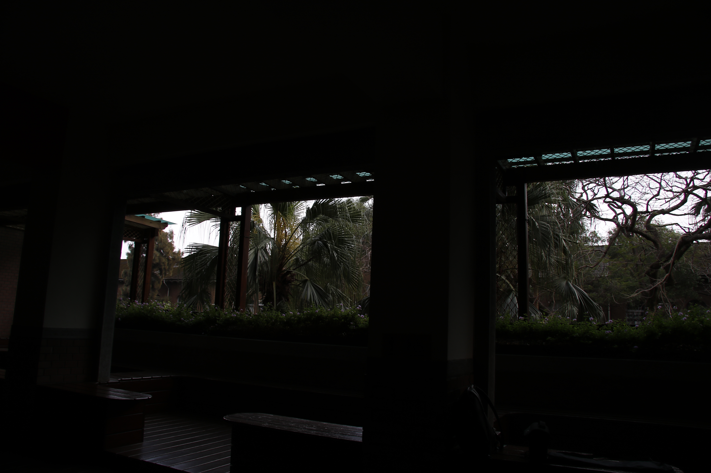
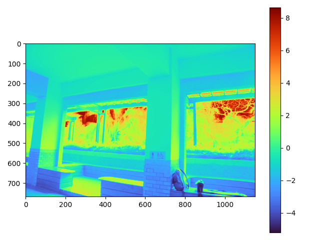
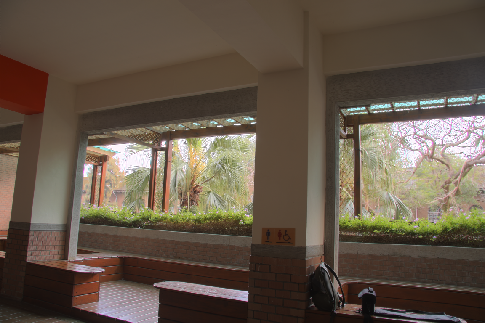
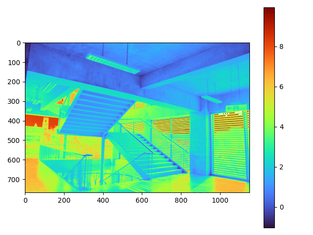
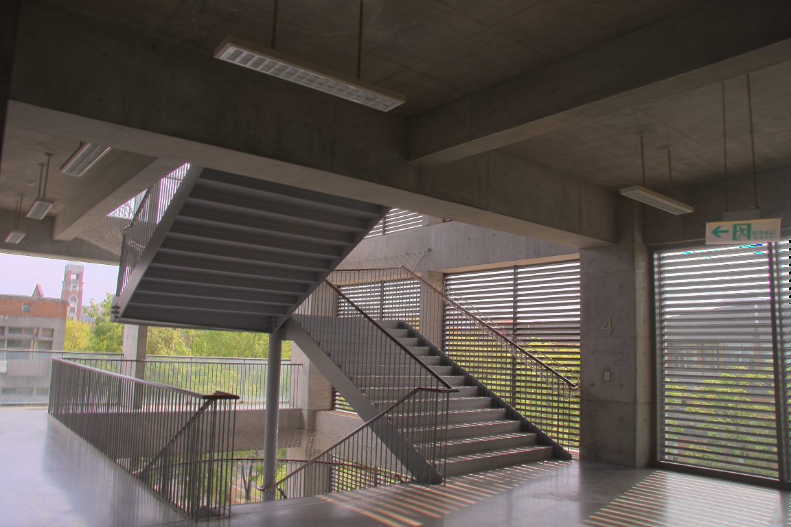

# NTU VFX2023 Homework 1

### execution:
Generate HDR Image and Tonemapped LDR Image:
```
$ python main.py --dataset <name_of_dataset> --dataset_info <path_to_textfile> --N <num_of_samplepoints_per_image> --tm_key <key_to_control_tonemapping>
```
to disable MTB image alignment, use ```--disable_mtb``` flag

Generate HDR Image only:
Ex.
```
python hdr_generator.py --dataset memorial --dataset_info ./../data/memorial/memorial.hdr_image_list.txt --N 20
```

Generate Tonemapped LDR Image only:
```
$ python tone_mapping.py 
```


Note:
- Currently ```<name_of_dataset>``` is set as ```ntu_sample1```.
- Output files are all saved at "./../data/output/" directory

## Results:
### ntu_sample1:
- original captured images:  

 
</br>
 

- calculated irradiance map:  

- reconstructed HDR images:  


### ntu_sample3:
- original captured images:  
 
<br/>
 
- calculated irradiance map:  

- reconstructed HDR images:  
